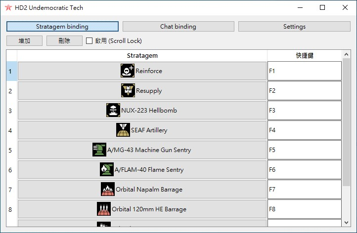
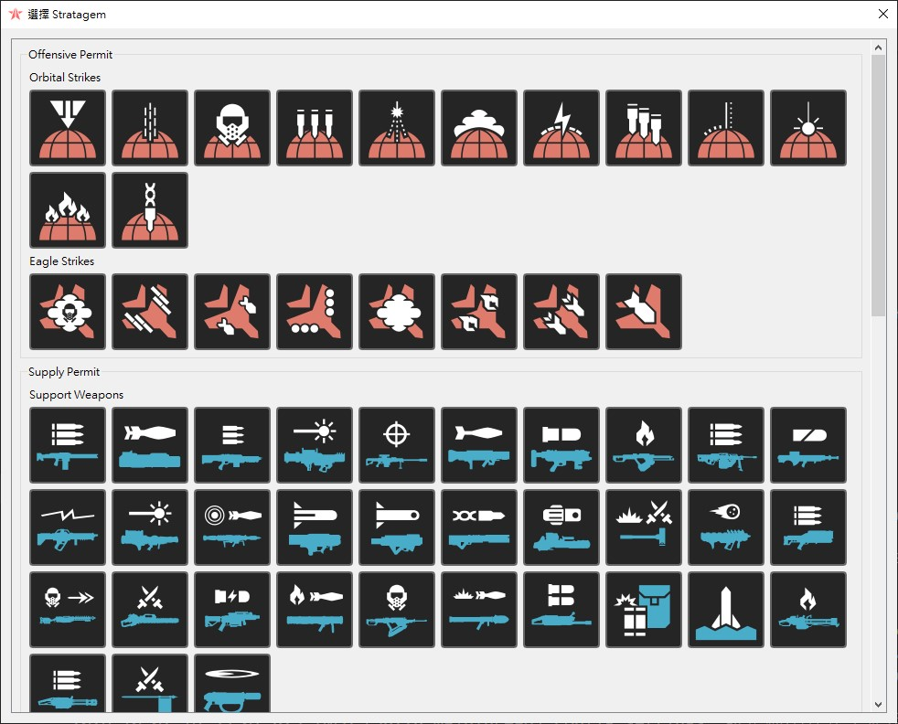
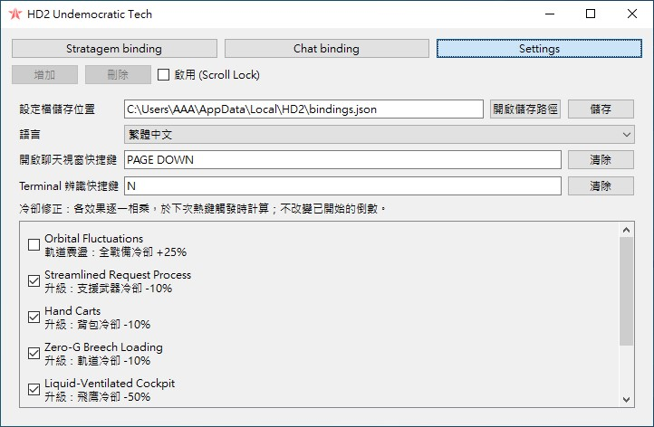

# HD2 Undemocratic Tech

[繁體中文](README.md) | [English](README_en.md)

Helldivers 2 戰備、聊天、終端輔助工具。

## 功能

1. **戰略配備快捷鍵**：綁定按鍵，自動輸入方向指令。
2. **聊天輔助**：綁定按鍵，發送預設文字，或另開視窗輸入完整字串。
3. **HUD 與預估倒數**：顯示戰備圖示及冷卻倒數。可調整位置，可套用艦橋升級以及星球環境計算冷卻時間。
4. **終端方向辨識**：綁定按鍵，螢幕截圖辨識箭頭序列並自動輸入。

## 介面截圖

### 快捷鍵綁定



### 戰略配備選擇



### 設定



## 啟動與打包

Run：

```bat
python -m pip install -r requirements.txt
python main.py
```

Build：

```bat
python -m pip install pyinstaller
.\build.bat
```
